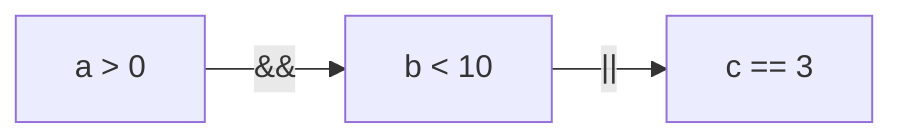

Приоритет операторов и скобки в условиях

## 1. Введение

Давайте начнём с бытовой аналогии. Представьте себе рецепт:

```text
Смешайте муку, яйца и сахар, взбейте, добавьте масло, взбейте ещё раз.
```

Выглядит странно? А теперь представьте, что между словами «взбейте» и «добавьте» стоят
уточняющие скобки или более понятная пунктуация. Порядок действий сразу становится яснее.

В программировании похожая ситуация возникает, когда вы пишете сложное выражение:

```
boolean result = a > 0 && b < 10 || c == 3;
```

Какой здесь порядок? Что вычисляется первым: `a > 0 && b < 10`, а потом `|| c == 3`?
Или всё наоборот? Без чёткого порядка вычислений компьютер мог бы «перепутать ингредиенты»,
и результат оказался бы неожиданным.

## 2. Приоритет операторов в Java

Java, как и большинство языков программирования, использует определённую таблицу приоритетов.
Операторы с более высоким приоритетом выполняются раньше, чем операторы с более низким
приоритетом.

Посмотрите на самую важную часть этой таблицы для условных выражений:

| Оператор             | Описание         | Приоритет     |
|----------------------|------------------|---------------|
| `()`                 | Скобки           | Самый высокий |
| `!`                  | Логическое «НЕ»  | Высокий       |
| `<`, `>`, `<=`, `>=` | Сравнения        | Средний       |
| `==`, `!=`           | Равно / не равно | Средний       |
| `&&`                 | Логическое «И»   | Ниже          |
| `\|\|`               | Логическое «ИЛИ» | Ещё ниже      |

Есть ещё арифметические операторы. Они имеют более высокий приоритет, чем операторы сравнения
и логические операторы.

### Главное правило

Оператор «И» (`&&`) имеет больший приоритет, чем оператор «ИЛИ» (`||`). То есть сначала
вычисляется «И», потом — «ИЛИ». Недаром «И» называют логическим умножением, а «ИЛИ» —
логическим сложением.

### Блок-схема вычисления приоритета условий



На практике выражение

```
a > 0 && b < 10 || c == 3
```

вычисляется так: сначала проверяется `a > 0 && b < 10`, а потом результат этой проверки
объединяется через `||` с результатом проверки `c == 3`.

## 3. Направление операторов: слева направо и наоборот

Кроме приоритета, есть ещё такое понятие, как ассоциативность. Это правило, которое определяет,
в каком направлении вычисляются операторы, если они стоят рядом и имеют одинаковый приоритет.

Пример:

```
boolean a = true, b = false, c = true;
boolean result = a && b && c;
```

Вопрос: как это посчитается? Ответ: ассоциативность у `&&` — слева направо. Значит, сначала
вычисляется `a && b`, а потом результат этой операции объединяется с `c`.

Применительно к условиям:

| Оператор     | Ассоциативность |
|--------------|-----------------|
| `&&`, `\|\|` | Слева направо   |
| `!`          | Справа налево   |

## 4. Скобки — ваш лучший друг в сложных условиях

Вот здесь начинается магия и спасение. Когда вы пишете выражение, скобки меняют приоритет
и делают ваш код понятнее и безопаснее.

Пример 1: без скобок.

```
// Мы хотим: «Если пользователь взрослый и гражданин,
// или если у него есть спецпропуск».

boolean isAdult = age >= 18;
boolean isCitizen = country.equals("Беларусь");
boolean hasPermit = hasSpecialPass == true;

if (isAdult && isCitizen || hasPermit) {
    System.out.println("Доступ разрешён!");
}
```

Как считает Java: сначала вычисляет `isAdult && isCitizen`, потом объединяет результат через
`||` с `hasPermit`.

Допустим:

* `isAdult = true`;
* `isCitizen = false`;
* `hasPermit = true`.

Тогда вычисление будет таким:

```text
isAdult && isCitizen → true && false → false
false || true → true
```

То есть если у человека есть спецпропуск, его всё равно пропустят. А если спецпропуска нет,
но человек взрослый и является гражданином, его тоже пропустят.

Пример 2: со скобками.

```
if (isAdult && (isCitizen || hasPermit)) {
    System.out.println("Доступ разрешён!");
}
```

Теперь программа сначала проверяет `isCitizen || hasPermit`, а затем объединяет этот результат
с `isAdult`.

То есть теперь нужно быть взрослым и при этом либо гражданином, либо человеком со спецпропуском.
Маленькая разница в скобках — огромная разница в логике!
